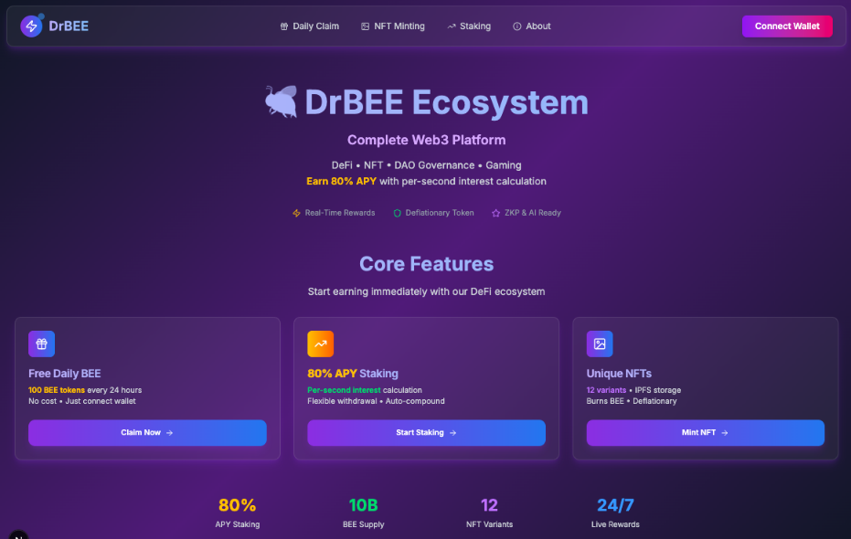
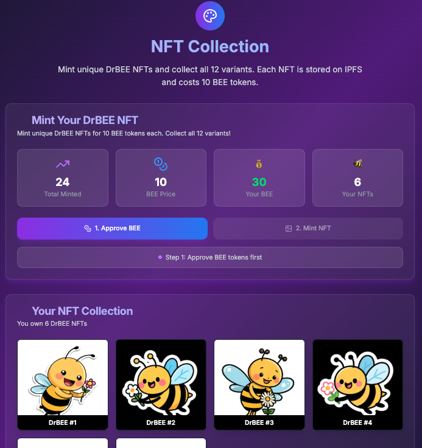
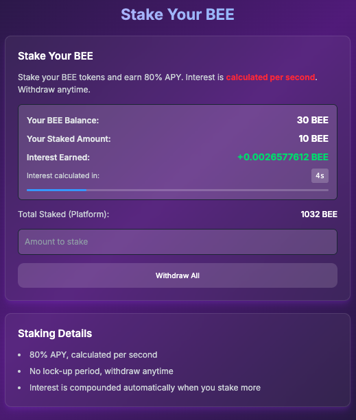

# 🐝 DrBEE - Decentralized Bee Ecosystem

<div align="center">



<h3>🍯 Complete Web3 DeFi Platform</h3>

[](https://aibee.netlify.app)
[](https://nextjs.org)
[](https://vercel.com)
[](https://ethereum.org)
[](https://getfoundry.sh)
[](https://openzeppelin.com)
[](https://tailwindcss.com)
[](https://rainbowkit.com)

---

</div>

## 🌟 Vision Statement

DrBEE aims to establish a self-sustaining blockchain ecosystem where users can participate and earn rewards through multiple pathways:
- 🍯 **Automated Token Acquisition** - Earn BEE tokens through automated mechanisms
- 🎨 **NFT Collection & Creation** - Mint unique bee-themed NFTs with rarity mechanics
- 💰 ****High-Yield Staking** - **80% APY with per-second interest calculation****
- 🗳️ **Decentralized Governance** - Participate in community decisions and anonymous voting
- 🎮 **On-Chain Gaming** - Rich gaming ecosystem with tokenized incentives
- 🎪 **Social Activities** - Host events using tokens and NFTs

## 🔥 Implemented Features

### 💎 Core DeFi Functionality
- **BEE Token (ERC20)** - 10 billion total supply with deflationary burn mechanism
- **Smart Faucet System** - Claim 100 BEE tokens every 24 hours
- **High-Yield Staking** - 80% APY with per-second compound interest (flexible withdrawal)
- **NFT Marketplace** - Mint unique NFTs by burning BEE tokens (deflationary)

### 📊 Staking Yield Calculation Formula
```
Annual Percentage Yield = 80% APY
Per-Second Interest Rate = 80% ÷ (365 × 24 × 3600) = 0.00000002537
Interest = Principal × Time(seconds) × Per-Second Rate
Real-Time Compounding = Auto-reinvestment of accrued interest on additional stakes
```

### 🎨 NFT Ecosystem
- **12 Unique Variants** - Each NFT features distinct rarity attributes
- **IPFS Storage** - Decentralized metadata storage infrastructure
- **Deflationary Mechanism** - BEE token burn during minting process
- **Capped Supply** - Maximum 10,000 NFTs mintable

## 🚀 Technology Stack

### Smart Contract Layer
- **Solidity 0.8.24** + **Foundry** framework
- **OpenZeppelin** security standards
- **Sepolia Testnet** deployment
- Reentrancy attack protection

### Frontend Application
- **Next.js 15** + **TypeScript** for type safety
- **TailwindCSS 4.0** - Modern UI framework
- **RainbowKit + Wagmi** - Web3 integration suite
- **Viem** - Ethereum interaction library

## 📱 Application Screenshots

<div align="center">

### 🏠 Homepage - Complete Web3 Ecosystem Overview


### 🎨 NFT Minting - Unique Bee-Themed Collections


### 💰 Staking - 80% APY with Real-Time Interest


</div>

## 📦 Quick Start

### Prerequisites
- Node.js 18+
- npm/yarn/pnpm package manager

### Installation
```bash
npm install
```

### Development Server
```bash
npm run dev
```

### Configuration (Optional)
For better reliability, you can configure a custom RPC endpoint by setting the `SEPOLIA_RPC_URL` environment variable:

```bash
# Create .env.local file
echo "SEPOLIA_RPC_URL=https://your-sepolia-rpc-url" > .env.local
```

**Recommended free RPC providers:**
- [Alchemy](https://www.alchemy.com/) - `https://eth-sepolia.g.alchemy.com/v2/YOUR_API_KEY`
- [Infura](https://infura.io/) - `https://sepolia.infura.io/v3/YOUR_PROJECT_ID`
- [QuickNode](https://www.quicknode.com/) - Various endpoints available

*Note: The app uses multiple fallback RPC endpoints by default, so custom configuration is optional.*

### Deployed Contract Addresses (Sepolia Testnet)
```
BEE Token:     0x2011551065B37D6762D7401ebBaa39adc4eED0e7
Vault:         0x1c852498880ff2711a62541C4A36AE8dDEC6dfE9
BeeStaking:    0x7C12D5a404867F9E265FbB6947aC46592B226451
DrBEE NFT:     0xA6C0E968cCF8DB76eEDe84Bf3d62151c999208BD
```

[](https://sepolia.etherscan.io/address/0x2011551065B37D6762D7401ebBaa39adc4eED0e7)
[](https://sepolia.etherscan.io/address/0x1c852498880ff2711a62541C4A36AE8dDEC6dfE9)
[](https://sepolia.etherscan.io/address/0x7C12D5a404867F9E265FbB6947aC46592B226451)
[](https://sepolia.etherscan.io/address/0xA6C0E968cCF8DB76eEDe84Bf3d62151c999208BD)

## 🛣️ Development Roadmap

### ✅ Phase 1: Core Infrastructure (Completed)
- [x] ERC20 token contract implementation
- [x] Faucet system with time-lock mechanisms
- [x] NFT minting and collection features
- [x] Staking mining system with compound interest
- [x] Modern frontend interface with Web3 integration

### 🔄 Phase 2: Automation & Enhancement (In Development)
- [ ] **Automated Claim Mechanism** - Scheduled automatic BEE distribution
- [ ] **Premium NFT Collections** - Rarity systems and special attributes
- [ ] **Advanced Staking Features** - Lock period options with reward multipliers
- [ ] **Mobile Optimization** - Progressive Web App (PWA) support

### 🎯 Phase 3: DAO Governance (Planning Phase)
- [ ] **Governance Token System** - Voting weight based on BEE and NFT holdings
- [ ] **Proposal & Voting Framework** - Community-driven decision mechanisms
- [ ] **Zero-Knowledge Proof Voting** - Anonymous voting with privacy protection
- [ ] **Multi-Signature Treasury** - Community fund management

### 🎮 Phase 4: Gaming & Social Features (Future Development)
- [ ] **On-Chain Mini Games** - Bee-themed casual gaming experiences
- [ ] **Event Management System** - Create activities using tokens and NFTs
- [ ] **Leaderboards & Achievements** - Gamified incentive mechanisms
- [ ] **Social Interaction Features** - User engagement and community building

### 🔮 Phase 5: Advanced Technologies (Long-term Vision)
- [ ] **Cross-Chain Bridge** - Multi-chain ecosystem expansion
- [ ] **AI-Driven Content** - Intelligent NFT generation and curation
- [ ] **Metaverse Integration** - VR/AR immersive experiences
- [ ] **Enterprise Solutions** - Institutional-grade features and APIs

## 🏗️ Project Architecture

```
drbee-dapp/
├── packages/contracts/         # Solidity smart contracts
│   ├── src/                   # Contract source code
│   ├── test/                  # Contract test suites
│   └── script/                # Deployment scripts
├── src/                       # Next.js frontend application
│   ├── app/                   # Page routing structure
│   ├── components/            # React components library
│   ├── hooks/                 # Custom React hooks
│   └── utils/                 # Utility functions
└── packages/ipfs_images/      # NFT asset resources
```

## 🤝 Contributing Guidelines

We welcome community contributions! Please review our [Contributing Guide](CONTRIBUTING.md) to learn how to participate in project development.

### Development Workflow
1. Fork the repository
2. Create a feature branch (`git checkout -b feature/AmazingFeature`)
3. Commit your changes (`git commit -m 'Add some AmazingFeature'`)
4. Push to the branch (`git push origin feature/AmazingFeature`)
5. Submit a Pull Request

## 📄 License

This project is licensed under the MIT License. See the [LICENSE](LICENSE) file for details.

## 🔗 Related Resources

- [Technical Documentation](./packages/contracts/README.md)
- [Product Requirements Document](./prd.md)
- [Smart Contract Source Code](./packages/contracts/src/)


## 📞 Community & Support

- **GitHub Issues**: [Report bugs or request features](https://github.com/yourusername/drbee-dapp/issues)
- **Discord**: [Join our community](https://discord.gg/drbee) *(Coming Soon)*
- **Twitter**: [Follow for updates](https://twitter.com/drbee_ecosystem) *(Coming Soon)*

---

<div align="center">

**🐝 Join the Hive, Earn the Honey! 🍯**

*DrBEE - Empowering everyone through blockchain technology*

[](https://github.com/yourusername/drbee-dapp)
[](https://github.com/yourusername/drbee-dapp/fork)

</div>
